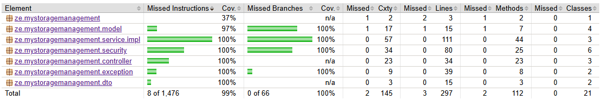

# 📦 Storage Management API

**[StorageManagementApp](https://zeli8888.ddns.net/storage-management/)** is a responsive web application designed to help you manage food storage. 
Always forget how much you left in the fridge like me? This app can help you keep track of it and record your meals. 🎉

**Frontend Repository**: https://github.com/zeli8888/MyStorageManagement.git

---

## 📋 Table of Contents
- [✨ Features](#-features)
- [🚀 Getting Started](#-getting-started)
  - [⚙️ Configuration](#️-configuration)
  - [🔧 Installation](#-installation)
- [💻 Usage](#-usage)
- [📂 Project Structure](#-project-structure)
- [🤝 Contributing](#-contributing)
- [📝 License](#-license)
- [📧 Contact](#-contact)

---

## ✨ Features
- **Food Storage Management System📦**
    - complete CRUD service for ingredient/dish/dishRecord
    - enforced constraint for relationship between ingredient/dish/dishRecord
    - update ingredients storage automatically with dishRecord
    - cost/consume analysis for custom time range 

- **Firebase Authentication Integration🪪**
    - JWT verification for scalable server-side authentication
    - integrate ingredient/dish/dishRecord with user identify
    - user can only access their own data

- **Security Measures🔐**
    - A strict CORS (Cross-Origin Resource Sharing) policy is applied to restrict AJAX requests to requests originating from the front-end domain.
    - The Spring Boot Security chain is employed to enforce authentication for data access.

- **Complete Test Cases with 99% Coverage🧑‍🔬**
    - Unit Testing for all controllers and services
    - Integration Test for authentication and security
    
---

## 🚀 Getting Started

### ⚙️ Configuration
- Check [application.properties](src/main/resources/application.properties) for application configuration.
- Check [postgres.yaml](postgres.yaml) for postgresql database configuration.
- Check [storage-management-api.yaml](storage-management-api.yaml) for deploy configuration
- To configure the project, set the following environment variables first:

    ```env
    STORAGE_MANAGEMENT_POSTGRES_URL=your_database_url
    DB_PASSWORD=your_database_password
    STORAGE_MANAGEMENT_POSTGRES_VOLUME=your_database_container_volume_url
    FIREBASE_CREDENTIALS_FILE=your_file_url_for_firebase_private_key
    ```

### 🔧 Installation
To get started with **StorageManagementAPI**, follow these steps:

1. Clone the repository:
   ```bash
   git clone https://github.com/zeli8888/MyStorageManagement-API.git
   ```

2. Navigate to the project directory:
   ```bash
   cd MyStorageManagement-API
   ```

3. Install dependencies and run test (make sure Maven is correctly configured):
   ```bash
   mvn test
   ```
   optional: check the test report with Jacoco:
   ```bash
   mvn test jacoco:report
   ```
   report will be generated at
   ```bash
   /target/site/jacoco/index.html
   ```
---

## 💻 Usage
Here’s how to use **StorageManagementAPI**:

- Run it in dev mode:

    ```bash
    mvn spring-boot:run
    ```

Or

- Deploy:

    1. fork this github repository:

    2. replace zeli8888 in [Jenkinsfile](Jenkinsfile) and [storage-management-api.yaml](storage-management-api.yaml) to your docker account:

    3. deploy jenkins pipeline with your forked github repository

    <br />Or Simply use my docker image (can't customize)
    <br />
    1. pull backend docker image
    ```bash
    docker pull zeli8888/storage-management-api:{version_you_like}
    ```
    2. run mysql container
    ```bash
    docker compose -p storage-management -f postgres.yaml up -d --force-recreate
    ```
    3. run backend docker container
    ```bash
    export version=${version_you_like} && docker compose -p storage-management -f storage-management-api.yaml up -d --force-recreate
    ```

    4. Access the application at `http://127.0.0.1:8001`.

    5. Configure Nginx for outer access (HTTPS is necessary).

---

## 📂 Project Structure
- deploy files: 
    - [postgres.yaml](postgres.yaml) for database configuration.
    - [storage-management-api.yaml](storage-management-api.yaml) for backend deploy configuration
    - [Jenkinsfile](Jenkinsfile) for jenkins deploy stage configuration
- src: follow a typical Spring MVC (Model-View-Controller) pattern.
---

## 🤝 Contributing
We welcome contributions! 🎉 If you'd like to contribute, please follow these steps:

1. Fork the repository.

2. Create a new branch:
   ```bash
   git checkout -b feature/your-feature-name
   ```

3. Commit your changes:
   ```bash
   git commit -m "Add your awesome feature"
   ```

4. Push to the branch:
   ```bash
   git push origin feature/your-feature-name
   ```

5. Open a pull request. 🚀

---

## 📝 License
This project is licensed under the **MIT License**. See the [LICENSE](LICENSE) file for details. 🐜

---

## 📧 Contact
If you have any questions or feedback, feel free to reach out:

- **Email**: zeli8888@outlook.com 📩
- **GitHub Issues**: [Open an Issue](https://github.com/zeli8888/MyStorageManagement-API/issues) 🐛

---

Made with ❤️ by [Ze Li](https://github.com/zeli8888). Happy coding! 🎉